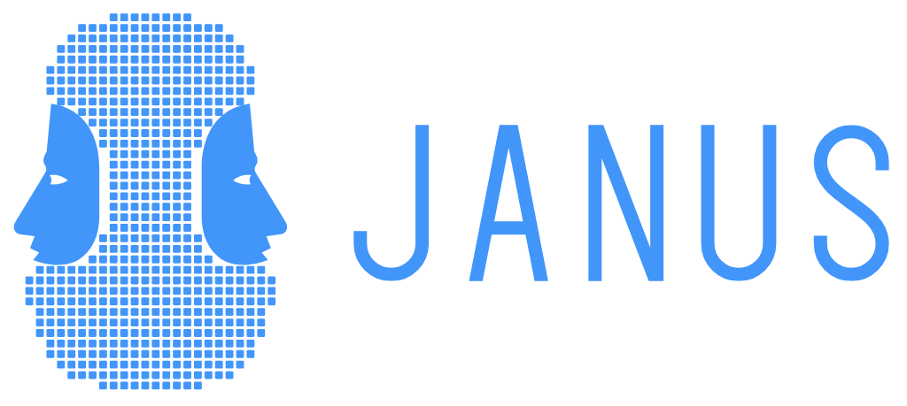

<p align="center">
  
</p>

<p align="center">
  <b>A fast desktop viewer for raster time series and data cubes.</b>
</p>

<p align="center">
  <a href="https://github.com/sacridini/janus/actions/workflows/build.yml"></a>
  <a href="https://github.com/sacridini/janus/releases/latest"></a>
  
</p>

<p align="center">
  <a href="https://sacridini.github.io/janus/"><b>Website</b></a> ·
  <a href="https://github.com/sacridini/janus/releases/latest">Download</a> ·
  <a href="docs/usage.md">Documentation</a> ·
  <a href="IDEIAS.md">Roadmap</a>
</p>


Janus opens a folder of rasters as a data cube, keeps the whole cube on the GPU
and shows the time series of any pixel as you move the mouse. It is made to
explore time series quickly, not to be a full GIS. Its command line is `jn`.

## Features

- **Opens any stack of rasters**: a folder (one file per date), a multiband file
  (one band per date), a list of files or a wildcard; dates come from file names
  or band descriptions.
- **13 map modes on the GPU**: value, anomaly, difference to a reference date,
  temporal statistics, trend, largest drop (date and magnitude), multitemporal
  RGB; changing date, colormap or stretch is instant.
- **Pixel series as you hover**, pins to compare places, a region with its mean
  and p10–p90 band; OLS and Sen trends.
- **Compare**: several series as layers, map panels side by side, a swipe
  divider, and space-time transects (distance × date).
- **Categorical series** (land cover, classifications) with class colours,
  names and change summaries; **several bands per date** with normalized
  differences and cloud masks.
- **Change detection built in**: LandTrendr, Mann-Kendall, BFAST, CCDC,
  phenology, TWDTW and more from [Zeit](https://github.com/sacridini/zeit-cdts),
  fitted live on the chart or run on the image. A private Python runtime ships
  with Janus.
- **Export**: maps as PNG figures, values and views as georeferenced GeoTIFFs,
  series as CSV.
- **Fast on any disk**: about 0.15 s to the first frame, a disk cache of the
  cube, and a full-resolution cache that serves a pixel's series in about 1 ms
  even when the data sit on a spinning hard disk.

## Install

Download the package for your system from the
[latest release](https://github.com/sacridini/janus/releases/latest). Each one
carries GDAL and the Python runtime with Zeit: nothing else to install.

| System | Package |
|---|---|
| Windows | `janus-<version>-setup.exe`: per-user installer, optional `jn` on `PATH` and *Open in Janus* in the right-click menu |
| macOS 15+ (Apple Silicon) | `janus-<version>-macos-arm64.dmg`: drag Janus to Applications; not notarized, so open it the first time with right click → Open |
| Linux x86_64 | `janus-<version>-linux-x86_64.tar.xz`: portable, extract and run `jn` |

Details for each system: [docs/install.md](docs/install.md).

## Quick start

```
jn D:\data\ndvi_annual\        # every raster in the folder, 1 file = 1 date
jn landsat_stack.tif           # 1 multiband file, 1 band = 1 date
jn "S2_*_NDVI.tif" --band 1    # a wildcard pattern
```

Or open a folder from the **File** menu, the **Files** panel, or by dropping it
on the window. Then:

| | |
|---|---|
| Hover | the pixel's series (exact once the mouse rests) |
| Click / `Shift` + drag | drop a pin / draw a region |
| `←` `→` / `Space` | previous or next date / play |
| `Ctrl` + drag / `S` | space-time transect / swipe |
| `Ctrl+T` / `Ctrl+W` | open / close a map panel |

Everything else is in [docs/usage.md](docs/usage.md) and under **Help →
Shortcuts and usage**.

## Documentation

- [Usage](docs/usage.md): command line, every interaction, the Zeit tools, performance notes
- [Installation](docs/install.md): details for Windows, macOS and Linux
- [Building from source](docs/building.md): Windows, Linux and macOS, the Zeit runtime, packages
- [Architecture](docs/architecture.md): how the cube flows from the files to the GPU, and the source files
- [IDEIAS.md](IDEIAS.md) (Portuguese): roadmap, design decisions and the measurements behind them

## Building

Janus is C++17 with CMake. It needs GDAL (e.g. from conda-forge); GLFW, Dear
ImGui, ImPlot and nlohmann/json are fetched by CMake.

```
cmake -S . -B build -DCMAKE_BUILD_TYPE=Release -DCMAKE_PREFIX_PATH=<gdal-prefix>
cmake --build build --config Release
```

See [docs/building.md](docs/building.md) for each platform, the Zeit runtime
and the installers.

---

Built with [Dear ImGui](https://github.com/ocornut/imgui),
[ImPlot](https://github.com/epezent/implot), [GDAL](https://gdal.org) and
[GLFW](https://www.glfw.org); OpenGL on Windows and Linux, Metal on macOS.
Change detection by [Zeit](https://github.com/sacridini/zeit-cdts). Janus was
called *tsv* up to version 0.16.
