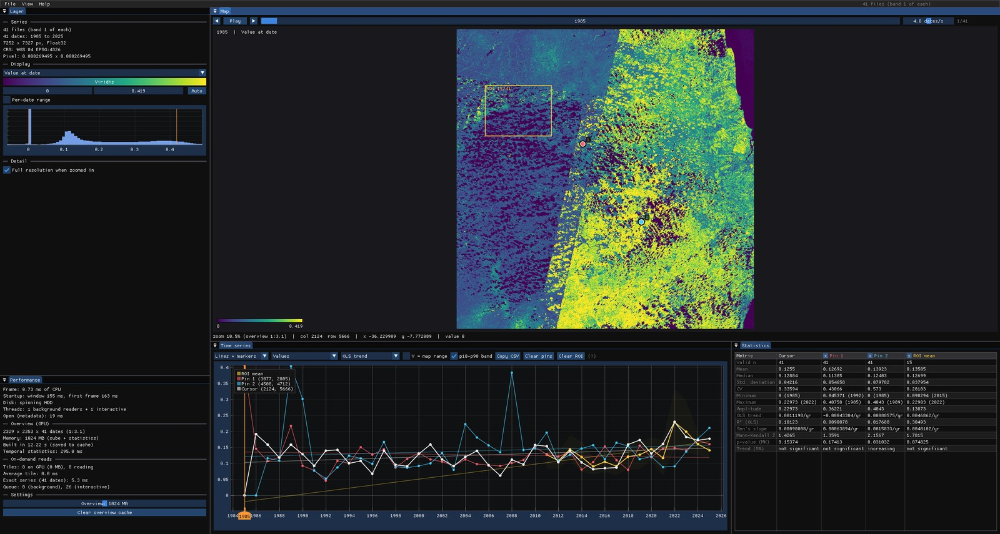

# Janus — raster time series viewer

**Janus** is a fast desktop viewer for raster time series and data cubes (one
date per file, or one date per band); its command line is `jn`. It keeps the
whole cube on the GPU, computes per-pixel temporal statistics in a shader, and
reads the exact series of any pixel in the background while you hover the map.
It is meant to *explore* time series quickly, not to be a full GIS.

Janus was called **tsv** up to version 0.16. Its data folders (layout, Zeit
results, overview cache) move to Janus's the first time it starts, and the
Windows installer removes an installed tsv.

Built with Dear ImGui (docking) + ImPlot + GDAL, in C++17; it draws through
OpenGL 3.3 on Windows and Linux and through Metal on macOS.



## Features

- **Opens** a folder of rasters (1 file = 1 date), a multiband file (1 band = 1
  date), a list of files or a wildcard pattern. Dates are parsed from file names
  or band descriptions (`YYYY-MM-DD`, `YYYYMMDD`, `YYYY_MM`, `YYYY`, `A2001001`, ...).
- **Categorical series** (land cover, masks, classifications): detected when
  the file has a colour table, category names or an attribute table, or when a
  date has only a few whole values. Each class gets the file's colour (or one of
  a qualitative palette) and name, editable in a legend; the chart shows the
  class sequence as steps with class names on the axis, and the statistics show
  the class at the date, the majority class, the number of changes and the last
  change (e.g. *2006: Forest → Pasture*).
- **Several bands per date** (e.g. one Landsat surface-reflectance file per
  date): show any band or a **normalized difference** of two (NDVI, NDMI, NBR...),
  and hide cloudy observations with a **quality band** (Fmask codes, Landsat
  Collection 2 `QA_PIXEL` bits or a 0/1 mask; a band named Fmask or QA_PIXEL is
  used automatically). Multiband tools such as CCDC read every band.
- **Map modes**, all computed on the GPU: value at date, anomaly (value − mean),
  temporal mean, standard deviation, linear trend (OLS, per year), minimum,
  maximum, amplitude, trend R² and a multitemporal RGB of three dates.
  Changing date, colormap or stretch is instant; there is an animation player.
- **Pixel series**: approximate (from the overview) as soon as you hover, exact
  (full resolution) once the mouse rests. Click to drop pins and compare pixels;
  Shift+drag a rectangle for an ROI (mean and p10–p90 per date).
- **Chart**: lines, markers, stems or stairs; raw values, anomaly or z-score;
  OLS or Sen trend line per series; Y axis locked to the map range if you want.
- **Statistics** per series: n, mean, median, std, CV, min/max (with date),
  amplitude, OLS slope + R², Sen's slope (the Mann-Kendall test, with
  autocorrelation corrections, is a Zeit tool).
- **Full resolution on zoom**: past the overview resolution, tiles of the visible
  area are read in the background and cached on the GPU.
- **Fast**: about 0.15 s from launch to the first frame; the app sleeps when
  nothing changes (a frame costs ~0.3 ms of CPU). The cube overview is cached on
  disk, so reopening a series takes a fraction of a second.
- **Copy CSV** of the cursor, pins and ROI series.
- **Layers**: open several series at once (e.g. NDVI and NBR of the same area,
  or neighboring scenes). Layers are placed by their georeferencing, can be
  shown/hidden (including the first one), reordered and faded; the chart shows
  the series of the active layer or of every visible layer at the cursor/pins.
- **Map panels side by side** (View → New map view): each panel shows one layer,
  optionally at its own date and in its own display mode (e.g. NDVI next to NBR,
  or 2005 next to 2020 of the same series). All panels show the same area: pan
  or zoom in any of them moves every one; the cursor is mirrored as a cross, and
  pins and the ROI appear in all of them. Panels dock anywhere or go to another
  monitor; they share the loaded data (no extra memory).
- **Files panel**: a folder tree listing only rasters by default; double click
  opens a series, right click adds it as a layer.
- **Detachable panels**: drag any panel out of the main window, e.g. the map on
  a second monitor and the charts on the first.
- **Zeit tools** ([Zeit](https://github.com/sacridini/zeit-cdts) change detection
  and time-series algorithms): **LandTrendr**, **Mann-Kendall** (with Sen's
  slope; Hamed-Rao, Yue-Wang and seasonal variants), **BFAST**, **BFAST Lite**,
  **BFAST Monitor**, **phenology** (season start/peak/end, length, amplitude),
  **CCDC** (multiband), **TWDTW classification** (classes from pins) and
  **smoothing** (Whittaker, Savitzky-Golay; chart only). Each is fitted live on the cursor, pins and ROI series
  (segments, trend lines, break dates, seasons or CCDC models drawn on the chart),
  or run on the whole image, the visible area or an ROI, with the results
  (year of detection, magnitude, slope, p-value, break dates...) shown as map
  layers. Zeit runs in a bundled, invisible Python runtime — nothing to install.

## Installation (Windows)

Run `janus-<version>-setup.exe`. It installs per user (no administrator prompt),
bundles GDAL and a private Python runtime with Zeit (no Python or conda needed,
nothing is added to your Python installations), adds a Start menu entry and,
optionally:

- adds Janus to `PATH`, so you can call it as `jn` from any terminal;
- adds **Open in Janus** to the right-click menu of folders and `.tif` files;
- creates a desktop shortcut.

## Installation (Linux x86_64)

Extract `janus-<version>-linux-x86_64.tar.xz` anywhere and run `jn` from that
folder (e.g. `~/apps/janus-<version>/jn serie.tif`, or link it into `~/.local/bin`).
The archive is portable: it carries GDAL and its libraries, the PROJ/GDAL data
and the private Python runtime with Zeit; only glibc, OpenGL and X11 come from
the system (tested on Ubuntu 24.04). `janus.desktop` and `janus.png` are included
for a menu entry. File dialogs use `zenity` or `kdialog` when installed; the
Files panel works without them. Data and caches live in `~/.local/share/janus`.

## Installation (macOS, Apple Silicon)

Open `janus-<version>-macos-arm64.dmg` and drag **Janus** into **Applications**.
The app carries GDAL and its libraries, the PROJ/GDAL data and the private
Python runtime with Zeit (macOS 15 or later). Folders and rasters can be opened
from the Finder (right click → Open With → Janus), by dropping them on the
window or the Dock icon, or from a terminal after linking the program once:

```
ln -s /Applications/Janus.app/Contents/MacOS/janus ~/.local/bin/jn   # or /usr/local/bin
```

The app is not signed with an Apple Developer ID: the first time, macOS says it
cannot verify the developer. Open it once with right click → Open (or allow it
in System Settings → Privacy & Security), or clear the download's quarantine
flag with `xattr -dr com.apple.quarantine /Applications/Janus.app`. Data lives in
`~/Library/Application Support/Janus`, the overview cache in `~/Library/Caches/Janus`.

Installers and packages are built from this repository (see
[Building](#building-from-source)); every tagged version publishes the three of
them on the [Releases](https://github.com/sacridini/janus/releases) page (GitHub
Actions, `.github/workflows/build.yml`).

## Command line

```
jn [options] [input ...]

Inputs:
  folder\             every raster in the folder, 1 file = 1 date
  series.tif          1 multiband file, 1 band = 1 date
  a.tif b.tif ...     several files, 1 file = 1 date
  "ndvi_*.tif"        wildcard pattern (* and ?)

Options:
  --band N            band used when each file is one date (default: 1)
  --budget MB         memory for the cube overview (default: 1024)
  --threads N         background reader threads (default: auto; HDD = 1)
  -h, --help          show this help
  --version           show the version

Developer options:
  --zeit-python EXE   Python with Zeit to use instead of the bundled runtime
                      (or set JANUS_ZEIT_PYTHON)
  --zeit-bridge PY    bridge script to use (or set JANUS_ZEIT_BRIDGE)
  --measure-startup   print startup timings and exit after the first frame
  --selftest-zeit IN  run the Zeit tools end to end on IN without a window
  --selftest-ui A B [C [D [E]]]  drive the layers workflow (A, then B as a layer;
                      C: several bands per date; D, E: categorical series with
                      and without a colour table) in a hidden window
```

Examples:

```
jn D:\data\ndvi_annual\
jn landsat_stack.tif
jn "S2_*_NDVI.tif" --band 1
```

`jn` opens the window and returns the prompt immediately (on Windows `jn.com` is
a small console launcher next to `janus.exe`, the same trick Visual Studio uses with
`devenv.com`).

## Using the viewer

| Action | How |
|---|---|
| Pan / zoom | drag / mouse wheel (zooming out stops at the image extent), `H` fits the map; trackpad: two fingers pan, pinch zooms |
| Pixel series | hover (exact once the mouse rests) |
| Compare pixels | click to drop a pin |
| Remove a pin | right click it (Mac: Control + click, or a two-finger click on the trackpad), `Delete` (last one) or the **x** in the statistics table |
| ROI | `Shift` + drag (mean and p10–p90 per date) |
| Time | `←`/`→` previous/next date, `Space` play/pause, click or drag on the chart |
| Map mode, colormap, range | **Display** panel, for the active layer (range is automatic 2–98%, or drag it) |
| Classes (categorical data) | **Display** panel → *Categorical (classes)*: legend with colours, names and shares (click a colour to change it, untick a class to hide it); detection can be switched off or forced |
| Band, index, cloud mask | **Display** panel → Bands (one file per date with several bands): band A, optional normalized difference with B, quality band; **Apply** reopens the layer in place |
| Performance panel | **View → Performance** (hidden by default): timings, Zeit status, overview memory |
| Several series | **Layers** panel or File → Add layer (`Ctrl+L`): show/hide, order, opacity, close; click a name to make it active |
| Browse files | **Files** panel: double click opens, right click → Add as layer; Ctrl+click selects several files |
| Chart of several layers | Time series panel → *All visible layers* (one marker shape per layer) |
| Second monitor | drag a panel's tab out of the main window |
| Maps side by side | View → New map view (`Ctrl+T`): pick the layer and, if wanted, its own date and mode in the panel's bar; every panel follows the same pan/zoom; close it with its tab's **x** or `Ctrl+W` (the focused panel, else the last one opened) |
| Chart options | style, values/anomaly/z-score, trend (OLS/Sen), Y = map range |
| Export | **Copy CSV** in the Time series panel |
| Zeit tools | **Tools** menu → tool window (parameters, chart fitting, raster runs); progress in **Tools → Tasks** |
| Tool results | listed under their layer in the **Layers** panel: show/hide, colormap, range, opacity |

Clicking a legend entry hides/shows that series together with its trend line.

## Zeit tools

The **Tools** menu lists the algorithms of [Zeit](https://github.com/sacridini/zeit-cdts)
that Janus exposes:

| Tool | Series | Maps |
|---|---|---|
| LandTrendr | annual (one date per year) | year of detection, magnitude, duration, pre/post value, rate, DSNR of the chosen loss/gain event |
| Mann-Kendall | any (seasonal variant: several dates per year) | significant Sen's slope, slope, p-value, Z, tau, trend class, intercept |
| BFAST | regular, ≥ 2 dates per year | trend/season break counts, date and magnitude of the largest trend break |
| BFAST Lite | regular, ≥ 2 dates per year | break count, date and magnitude of the largest break, first break date |
| BFAST Monitor | regular, ≥ 2 dates per year | first break date in the monitoring period, magnitude, break yes/no |
| Phenology | ≥ 6 dates per year | start, peak and end of season (day of year), length, peak value, amplitude, fit R², seasons — for a typical year (median), the latest season or a chosen year |
| CCDC | one file per date with blue, green, red, NIR, SWIR1, SWIR2 [+ thermal]; a quality band is recommended | break count, largest break date and magnitude, NDVI change, first/last break, segments |
| TWDTW classification | dates | class map (one class per pattern, with a legend), distance, margin to the 2nd class |
| Smoothing | any | chart only: the smoothed series (Whittaker or Savitzky-Golay) |

**TWDTW classes** come from the series itself: drop pins on places you know
(forest, crop, pasture...), open the tool and *Add a pattern from* each pin (or
the ROI mean), and name the classes. Patterns are matched on real dates, so they
should cover the same period as the series.

"Regular" means evenly spaced dates (monthly, 16-day...): a missing date must be
a no-data band, not a skipped one. BFAST and BFAST Lite are slow (~2–3 ms per
pixel on all cores): use the visible area or an ROI before a whole scene.

Multiband tools show a **Bands** section in their window: which band of each
date plays each role (guessed from the band names, e.g. `NIR`, `SWIR1`; unnamed
stacks of 6+ bands are taken as Blue, Green, Red, NIR, SWIR1, SWIR2). CCDC
works on reflectance × 10000 internally; reflectance 0–1 and Landsat C2 Level-2
digital numbers are detected and converted (parameter *Units*). Its model is
drawn in the units of what the layer shows (a band or a normalized difference).

Each tool window has:

- **Parameters**, generated from the tool description sent by Zeit (hover a
  field for help). Tools that do not fit the open series are disabled with the
  reason (e.g. LandTrendr needs an annual series).
- **On the chart**: fits the model to the cursor, pin and ROI series and draws it
  over them in the same color (LandTrendr segments and vertices, Sen's line,
  vertical lines at break dates); the model's numbers are added to the
  Statistics table. With *All visible layers* on the chart, single-band tools
  are also fitted to the other layers' cursor and pin series.
- **Estimated run time** for the chosen scope, measured by Zeit on samples of
  the series (a fixed cost per block plus a cost per pixel; reading the data is
  not included).
- **Run on the raster**: whole image, visible area or ROI. The run happens in a
  separate process using every CPU core, with progress and cancel in
  **Tools → Tasks**. Outputs are GeoTIFFs (default folder
  `%LOCALAPPDATA%\Janus\results`) loaded over the map and listed under their
  series in the Layers panel; cells without an event are transparent.

How it works: Zeit runs in a separate Python process from a private runtime
inside the installation (`runtime\`: embeddable Python 3.12 + Zeit from PyPI +
numpy/scipy/rasterio/numba/dask/xarray, without PyTorch). It starts in the
background once a series is open (~1 s), so it never delays startup. The bridge
(`zeit_bridge/janus_zeit_bridge.py`) handles the protocol and reads/writes rasters
in chunks with progress; each tool is a small module next to it
(`zeit_bridge/tool_*.py`) that describes its parameters and outputs and calls
Zeit's API for one series or one block of pixels. Adding a tool to Janus means
adding a module there — no C++ change.
Janus hands it the cube as a VRT (dates in order, nodata and scale applied).
Logs: `%LOCALAPPDATA%\Janus\zeit.log`.

### Performance notes

- The first open of a cube builds a reduced overview of every date (in parallel
  on SSDs) and caches it in `%LOCALAPPDATA%\Janus\cache` (macOS: `~/Library/Caches/Janus`); later opens read that one
  file. Each date is saved as soon as it is built, so closing Janus in the
  middle of a build loses nothing: the next open reads those dates from the cache
  and builds only the missing ones. The **Performance** panel shows startup,
  build and read timings.
- Spinning HDDs are detected and read with a single sequential reader (two
  readers were measured to be 4× slower). While the overview builds on an HDD,
  pins, ROI and detail tiles wait, so the head is not pulled away.
- On an HDD the first open is bound by how fast the disk can sweep the files:
  GeoTIFFs stored as 1-row strips must be read almost entirely, even for a
  reduced overview. Cloud-optimized GeoTIFFs (tiled, with internal overviews) or
  an SSD make the first open much faster.

## Building from source

Requirements: CMake ≥ 3.21, a C++17 compiler (Visual Studio 2022 on Windows,
GCC or Clang elsewhere) and a GDAL installation with CMake config files, e.g. a
conda-forge environment (`conda create -n geo -c conda-forge gdal`). GLFW, Dear
ImGui, ImPlot and nlohmann/json are downloaded by CMake (`FetchContent`).

### Windows

```powershell
cmake -S . -B build -G "Visual Studio 17 2022" -A x64 -DCMAKE_PREFIX_PATH="<conda-env>\Library"
cmake --build build --config Release
.\build\Release\janus.exe
```

The post-build step (`cmake/deploy_runtime.cmake`) copies `gdal.dll` and all of
its dependencies, plus `proj.db` and `share/gdal`, next to the executable, so the
build runs on double click and never picks up another GDAL from `PATH`.

Zeit runtime for local builds (downloads the embeddable Python and the pinned
wheels from `zeit_bridge/requirements.txt`; the bridge script itself is copied
on every build, so editing a tool needs no runtime rebuild):

```powershell
cmake --build build --config Release --target zeit_runtime   # -> build\Release\runtime
.\build\Release\janus.exe --selftest-zeit <series>              # end-to-end check, no window
```

To work on Zeit itself, point Janus at your own environment:
`jn --zeit-python <env>\python.exe` (or `JANUS_ZEIT_PYTHON`).

Installer (requires [Inno Setup 6](https://jrsoftware.org/isinfo.php)); it
assembles its own copy of the runtime in `build\package`:

```powershell
cmake --build build --config Release --target installer   # -> dist\janus-<version>-setup.exe
```

### Linux

Everything (compiler, GDAL, X11/OpenGL headers) can come from one conda-forge
environment, so nothing needs to be installed system-wide:

```bash
conda create -n janus-linux -c conda-forge cmake ninja cxx-compiler c-compiler pkg-config gdal \
    xorg-libx11 xorg-libxrandr xorg-libxinerama xorg-libxcursor xorg-libxi xorg-libxext libgl-devel
conda activate janus-linux
cmake -S . -B build -G Ninja -DCMAKE_BUILD_TYPE=Release -DCMAKE_PREFIX_PATH="$CONDA_PREFIX" -DGLFW_BUILD_WAYLAND=OFF
cmake --build build
cmake --build build --target zeit_runtime     # -> build/runtime (python-build-standalone + Zeit)
./build/janus --selftest-zeit <series>
cmake --build build --target package_linux    # -> dist/janus-<version>-linux-x86_64.tar.xz
```

(`-DGLFW_BUILD_WAYLAND=OFF` skips GLFW's native Wayland backend, which needs
`wayland-scanner`; on Wayland desktops Janus runs through XWayland.)

### macOS (Apple Silicon)

Builds with the Xcode command line tools (AppleClang) and GDAL from a conda
environment; tested on macOS 26, UI and Zeit self-tests pass:

```bash
conda create -n geo -c conda-forge gdal
cmake -S . -B build -DCMAKE_BUILD_TYPE=Release -DCMAKE_PREFIX_PATH="$HOME/miniconda3/envs/geo" \
    -DPython3_EXECUTABLE="$HOME/miniconda3/envs/geo/bin/python3"
cmake --build build -j
cmake --build build --target zeit_runtime     # -> build/runtime (python-build-standalone + Zeit)
./build/janus --selftest-zeit <series>
ln -s "$PWD/build/janus" ~/.local/bin/jn       # jn from any terminal (runtime/ is found through the link)
cmake --build build --target package_macos    # -> dist/janus-<version>-macos-arm64.dmg (Janus.app)
```

It renders through Metal (`JANUS_RENDERER=METAL`, the default on macOS): the cube
and its statistics live in shared-memory buffers that the shaders read directly,
so uploading a date is a copy in RAM, and the shaders are compiled at startup
(the command line tools have no offline Metal compiler; the system caches them).
The cube buffer *is* the overview's page-aligned array (`newBufferWithBytesNoCopy`):
nothing is uploaded and the cube exists once in RAM, so `--budget` is the
memory the overview takes in total (with OpenGL it is taken on the GPU and again
in RAM, which on Apple Silicon is the same memory). With a 1 GB cube on an M4:
1.2 GB footprint (OpenGL: 3.8 GB), loaded from the cache in 0.2 s.
`-DJANUS_RENDERER=GL` builds the OpenGL path instead, e.g. to compare both.

The build tree links GDAL from the conda environment through an absolute RPATH,
so it breaks if that environment is removed; `package_macos` makes the
self-contained app (`cmake/package_macos.cmake`: the library chain in
`Contents/Frameworks`, data and runtime in `Contents/Resources`, ad hoc
signature). The Zeit runtime re-signs (ad hoc) the native libraries it
strips: on Apple Silicon a binary with an invalid signature is killed on load.

On a Retina display the map is drawn at the density of the screen it is on
(2 pixels per point), and full-resolution tiles are chosen by screen pixels.
The overview cache lives in `~/Library/Caches/Janus` (purgeable, skipped by Time
Machine); the rest of the data in `~/Library/Application Support/Janus`.

## Architecture

```
 files (GDAL) ──► Overview (CPU, [t][y][x] float32) ──► GpuCube (R32F texture array)
       │               │ disk cache (%LOCALAPPDATA%\Janus\cache)      │
       │               └─ instant approximate series                  ├─► statistics shader (1 pass)
       │                                                              └─► display shader (stretch, colormap, modes)
       ├──► TileManager: full-resolution tiles of the visible area ──► LRU cache on the GPU
       └──► exact pixel series / ROI (interactive pool, cancellable)
```

| File | Role |
|---|---|
| `src/cube.*` | Layer, date and band discovery; per-thread GDAL reader (nodata → NaN, scale/offset, normalized difference, QA mask) |
| `src/overview.*` | Reduced cube built in parallel, following the focused date; disk cache |
| `src/gpu.hpp` | Renderer-neutral GPU layer: cube, per-pixel temporal statistics, map drawing, textures (`GpuTex`) |
| `src/gpu_gl.cpp`, `src/gpu_metal.mm` | Its OpenGL 3.3 (GLSL) and Metal (MSL, shared-memory buffers) backends |
| `src/render_backend*` | Window and context, ImGui renderer backend, present (main window and detached panels): OpenGL or Metal |
| `src/tiles.*` | Detail tiles per zoom level; drops requests that left the screen |
| `src/session.*` | One open series: thread pools, exact series, ROI |
| `src/stats.*` | OLS, Sen's slope, percentiles |
| `src/app.*` | User interface (ImGui/ImPlot) |
| `src/app_layers.cpp` | Several series as layers (alignment, active layer, other layers' series), Layers and Files panels |
| `src/app_classes.cpp` | Categorical series: detection, class colours and names, legend, class statistics |
| `src/file_browser.*` | Lazily listed folder tree (rasters only by default) |
| `src/app_selftest.cpp` | `--selftest-ui`: the layers workflow in a hidden window, checked by reading map pixels |
| `src/app_zeit.cpp` | Tools menu, tool windows, tasks, result layers, models on the chart |
| `src/zeit_client.*` | Bridge processes (JSON lines over pipes; Win32 or POSIX), pixel calls, raster jobs, estimates |
| `src/results.*` | Result rasters loaded as map layers |
| `src/selftest.cpp` | `--selftest-zeit`: every applicable Zeit tool end to end (pixel + raster job) without a window |
| `zeit_bridge/` | The Python bridge, one `tool_*.py` per Zeit tool family, the pinned runtime requirements |
| `tools/build_zeit_runtime.py` | Assembles the private Python runtime (Windows, Linux, macOS) |
| `cmake/package_linux.cmake` | Portable Linux package (bundled libraries, RPATH `$ORIGIN/lib`) |
| `cmake/package_macos.cmake` | macOS app and `.dmg` (bundled libraries, RPATH `@executable_path/../Frameworks`, ad hoc signature) |
| `.github/workflows/build.yml` | CI: Windows, Linux and macOS builds, self-tests, installers; releases on `v*` tags |
| `tools/make_selftest_data.py` | Synthetic inputs for `--selftest-ui` and `--selftest-zeit` |
| `src/platform.*` | OS-specific: arguments, dialogs, data folder, opening folders, HDD detection (Windows, Linux, macOS) |
| `src/launcher.cpp` | `jn.com` console launcher |

## Roadmap

Planned work and the reasoning behind design decisions live in
[IDEIAS.md](IDEIAS.md) (in Portuguese). Next: reprojection of layers with
different CRSs and ROI on every layer; then new views (space-time transect,
year x day-of-year heatmap, swipe, area per class over time). Janus runs on Windows, Linux
(x86_64) and macOS (Apple Silicon, from a source build; no `.app` bundle yet). The
OS-specific code is isolated (see the portability table in IDEIAS.md).
